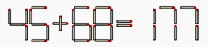
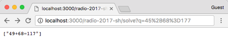
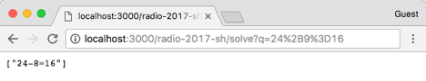
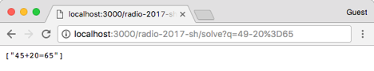
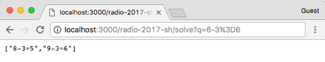
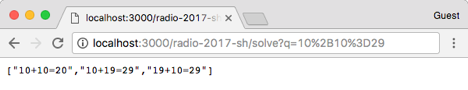
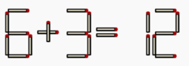

# iMatchstick - Matchstick Arithmetic Puzzle Solver and Beyond

## Basic Problem to Solve

Digits composed of matchsticks are listed as following:

A, B, C are nonnegative integers and we have A, B < 100, and C < 200. Input an equation in forms of A+B=C or A-B=C with ONE matchstick misplaced like this:

List ALL answer(s) to this puzzle to correct the equation by moving ONLY ONE matchstick.

["49+68=117"]

### Examples

## Optional Bonus Problem to Solve

Given the number of sticks to move, output all answers to a puzzle.

For example, given 2 as the number of sticks to move and

the answers are:
["3+9=12","8+4=12"]

Given 3 as the number of sticks to move and the same puzzle, the answers are:

## Notice

* A legal puzzle follows the following pattern.

![Puzzle Pattern](data:image/svg+xml;base64,PD94bWwgdmVyc2lvbj0iMS4wIiBzdGFuZGFsb25lPSJubyI/Pgo8c3ZnIHhtbG5zPSJodHRwOi8vd3d3LnczLm9yZy8yMDAwL3N2ZyIKICAgICB2ZXJzaW9uPSIxLjEiIHdpZHRoPSIzMzIuMjY1Njg2MDM1MTU2MjUiCiAgICAgaGVpZ2h0PSI5Ni43NTc3OTcyNDEyMTA5NCI+CiAgICA8ZGVmcz4KICAgICAgICA8c3R5bGUgdHlwZT0idGV4dC9jc3MiPnN2Z3tiYWNrZ3JvdW5kLWNvbG9yOiNmZmZ9dGV4dCx0c3Bhbntmb250OjEycHgKICAgICAgICAgICAgQXJpYWx9cGF0aHtmaWxsLW9wYWNpdHk6MDtzdHJva2Utd2lkdGg6MnB4O3N0cm9rZTojMDAwfWNpcmNsZXtmaWxsOiM2YjY2NTk7c3Ryb2tlLXdpZHRoOjJweDtzdHJva2U6IzAwMH0uYW5jaG9yCiAgICAgICAgICAgIHRleHQsLmFueS1jaGFyYWN0ZXIgdGV4dHtmaWxsOiNmZmZ9LmFuY2hvciByZWN0LC5hbnktY2hhcmFjdGVyIHJlY3R7ZmlsbDojNmI2NjU5fS5lc2NhcGUKICAgICAgICAgICAgdGV4dCwuY2hhcnNldC1lc2NhcGUgdGV4dCwubGl0ZXJhbCB0ZXh0e2ZpbGw6IzAwMH0uZXNjYXBlIHJlY3QsLmNoYXJzZXQtZXNjYXBlIHJlY3R7ZmlsbDojYmFkYTU1fS5saXRlcmFsCiAgICAgICAgICAgIHJlY3R7ZmlsbDojZGFlOWU1fS5jaGFyc2V0IC5jaGFyc2V0LWJveHtmaWxsOiNjYmNiYmF9LnN1YmV4cCAuc3ViZXhwLWxhYmVsIHRzcGFuLC5jaGFyc2V0IC5jaGFyc2V0LWxhYmVsCiAgICAgICAgICAgIHRzcGFuLC5tYXRjaC1mcmFnbWVudCAucmVwZWF0LWxhYmVsIHRzcGFue2ZvbnQtc2l6ZToxMHB4fS5yZXBlYXQtbGFiZWx7Y3Vyc29yOmhlbHB9LnN1YmV4cCAuc3ViZXhwLWxhYmVsCiAgICAgICAgICAgIHRzcGFuLC5jaGFyc2V0IC5jaGFyc2V0LWxhYmVsIHRzcGFue2RvbWluYW50LWJhc2VsaW5lOnRleHQtYWZ0ZXItZWRnZX0uc3ViZXhwCiAgICAgICAgICAgIC5zdWJleHAtYm94e3N0cm9rZTojOTA4YzgzO3N0cm9rZS1kYXNoYXJyYXk6NiwyO3N0cm9rZS13aWR0aDoycHg7ZmlsbC1vcGFjaXR5OjB9LnF1b3Rle2ZpbGw6IzkwOGM4M30KICAgICAgICA8L3N0eWxlPgogICAgPC9kZWZzPgogICAgPGcgY2xhc3M9InJvb3QiIHRyYW5zZm9ybT0ibWF0cml4KDEsMCwwLDEsMTUsMTApIj4KICAgICAgICA8ZyBjbGFzcz0icmVnZXhwIG1hdGNoIiB0cmFuc2Zvcm09Im1hdHJpeCgxLDAsMCwxLDEwLDApIj4KICAgICAgICAgICAgPHBhdGggZD0iTTQyLDQyLjAwMDAxMjVINjcuMjVNMTAyLjIzNDM3NSw0MkgxMjIuMjM0NE0xNTQuMjM0NCw0Mi4wMDAwMTI1SDE3OS40ODQ0TTIwNC40Njg3NzUsNDJIMjI0LjQ2ODgiPjwvcGF0aD4KICAgICAgICAgICAgPGcgY2xhc3M9Im1hdGNoLWZyYWdtZW50IiB0cmFuc2Zvcm09Im1hdHJpeCgxLDAsMCwxLDAsMzAuMjQyMikiPgogICAgICAgICAgICAgICAgPHBhdGggZD0iTTEwLDExLjc1NzgxMjVxLTEwLDAgLTEwLDEwdjEuNzU3ODEyNXEwLDEwIDEwLDEwaDMycTEwLDAgMTAsLTEwdi0xLjc1NzgxMjVxMCwtMTAgLTEwLC0xME01MiwyNi43NTc4MTI1bDUsLTVtLTUsNWwtNSwtNSI+PC9wYXRoPgogICAgICAgICAgICAgICAgPGcgY2xhc3M9ImVzY2FwZSIgdHJhbnNmb3JtPSJtYXRyaXgoMSwwLDAsMSwxMCwwKSI+CiAgICAgICAgICAgICAgICAgICAgPGcgY2xhc3M9ImxhYmVsIj4KICAgICAgICAgICAgICAgICAgICAgICAgPHJlY3Qgd2lkdGg9IjMyIiBoZWlnaHQ9IjIzLjUxNTYyNSIgcng9IjMiIHJ5PSIzIj48L3JlY3Q+CiAgICAgICAgICAgICAgICAgICAgICAgIDx0ZXh0IHg9IjAiIHk9IjAiIHRyYW5zZm9ybT0ibWF0cml4KDEsMCwwLDEsNSwxNi43NTc4KSI+CiAgICAgICAgICAgICAgICAgICAgICAgICAgICA8dHNwYW4+ZGlnaXQ8L3RzcGFuPgogICAgICAgICAgICAgICAgICAgICAgICA8L3RleHQ+CiAgICAgICAgICAgICAgICAgICAgPC9nPgogICAgICAgICAgICAgICAgPC9nPgogICAgICAgICAgICAgICAgPHRleHQgeD0iMCIgeT0iMCIgY2xhc3M9InJlcGVhdC1sYWJlbCIgdHJhbnNmb3JtPSJtYXRyaXgoMSwwLDAsMSwwLDQ0LjUxNTYpIj4KICAgICAgICAgICAgICAgICAgICA8dHNwYW4+YXQgbW9zdCBvbmNlPC90c3Bhbj4KICAgICAgICAgICAgICAgICAgICA8dGl0bGU+CiAgICAgICAgICAgICAgICAgICAgICAgIDx0ZXh0IHg9IjAiIHk9IjAiPnJlcGVhdHMgYXQgbW9zdCAyIHRpbWVzIGluIHRvdGFsPC90ZXh0PgogICAgICAgICAgICAgICAgICAgIDwvdGl0bGU+CiAgICAgICAgICAgICAgICA8L3RleHQ+CiAgICAgICAgICAgIDwvZz4KICAgICAgICAgICAgPGcgY2xhc3M9Im1hdGNoLWZyYWdtZW50IGNoYXJzZXQiIHRyYW5zZm9ybT0ibWF0cml4KDEsMCwwLDEsNjcuMjUsMCkiPgogICAgICAgICAgICAgICAgPHJlY3Qgcng9IjMiIHJ5PSIzIiBjbGFzcz0iY2hhcnNldC1ib3giIHRyYW5zZm9ybT0ibWF0cml4KDEsMCwwLDEsMCwxMSkiIHdpZHRoPSIzNC45ODQzNzUiCiAgICAgICAgICAgICAgICAgICAgICBoZWlnaHQ9IjYyIj48L3JlY3Q+CiAgICAgICAgICAgICAgICA8dGV4dCB4PSIwIiB5PSIwIiBjbGFzcz0iY2hhcnNldC1sYWJlbCIgdHJhbnNmb3JtPSJtYXRyaXgoMSwwLDAsMSwwLDExKSI+CiAgICAgICAgICAgICAgICAgICAgPHRzcGFuPk9uZSBvZjo8L3RzcGFuPgogICAgICAgICAgICAgICAgPC90ZXh0PgogICAgICAgICAgICAgICAgPGcgdHJhbnNmb3JtPSJtYXRyaXgoMSwwLDAsMSw1LDE2KSI+CiAgICAgICAgICAgICAgICAgICAgPGcgY2xhc3M9ImxpdGVyYWwiIHRyYW5zZm9ybT0ibWF0cml4KDEsMCwwLDEsMCwwKSI+CiAgICAgICAgICAgICAgICAgICAgICAgIDxnIGNsYXNzPSJsYWJlbCI+CiAgICAgICAgICAgICAgICAgICAgICAgICAgICA8cmVjdCB3aWR0aD0iMjQuOTg0Mzc1IiBoZWlnaHQ9IjIzLjUiIHJ4PSIzIiByeT0iMyI+PC9yZWN0PgogICAgICAgICAgICAgICAgICAgICAgICAgICAgPHRleHQgeD0iMCIgeT0iMCIgdHJhbnNmb3JtPSJtYXRyaXgoMSwwLDAsMSw1LDE2Ljc1KSI+CiAgICAgICAgICAgICAgICAgICAgICAgICAgICAgICAgPHRzcGFuIGNsYXNzPSJxdW90ZSI+4oCcPC90c3Bhbj4KICAgICAgICAgICAgICAgICAgICAgICAgICAgICAgICA8dHNwYW4+KzwvdHNwYW4+CiAgICAgICAgICAgICAgICAgICAgICAgICAgICAgICAgPHRzcGFuIGNsYXNzPSJxdW90ZSI+4oCdPC90c3Bhbj4KICAgICAgICAgICAgICAgICAgICAgICAgICAgIDwvdGV4dD4KICAgICAgICAgICAgICAgICAgICAgICAgPC9nPgogICAgICAgICAgICAgICAgICAgIDwvZz4KICAgICAgICAgICAgICAgICAgICA8ZyBjbGFzcz0ibGl0ZXJhbCIgdHJhbnNmb3JtPSJtYXRyaXgoMSwwLDAsMSwxLjUwNzgsMjguNSkiPgogICAgICAgICAgICAgICAgICAgICAgICA8ZyBjbGFzcz0ibGFiZWwiPgogICAgICAgICAgICAgICAgICAgICAgICAgICAgPHJlY3Qgd2lkdGg9IjIxLjk2ODc1IiBoZWlnaHQ9IjIzLjUiIHJ4PSIzIiByeT0iMyI+PC9yZWN0PgogICAgICAgICAgICAgICAgICAgICAgICAgICAgPHRleHQgeD0iMCIgeT0iMCIgdHJhbnNmb3JtPSJtYXRyaXgoMSwwLDAsMSw1LDE2Ljc1KSI+CiAgICAgICAgICAgICAgICAgICAgICAgICAgICAgICAgPHRzcGFuIGNsYXNzPSJxdW90ZSI+4oCcPC90c3Bhbj4KICAgICAgICAgICAgICAgICAgICAgICAgICAgICAgICA8dHNwYW4+LTwvdHNwYW4+CiAgICAgICAgICAgICAgICAgICAgICAgICAgICAgICAgPHRzcGFuIGNsYXNzPSJxdW90ZSI+4oCdPC90c3Bhbj4KICAgICAgICAgICAgICAgICAgICAgICAgICAgIDwvdGV4dD4KICAgICAgICAgICAgICAgICAgICAgICAgPC9nPgogICAgICAgICAgICAgICAgICAgIDwvZz4KICAgICAgICAgICAgICAgIDwvZz4KICAgICAgICAgICAgPC9nPgogICAgICAgICAgICA8ZyBjbGFzcz0ibWF0Y2gtZnJhZ21lbnQiIHRyYW5zZm9ybT0ibWF0cml4KDEsMCwwLDEsMTEyLjIzNDQsMzAuMjQyMikiPgogICAgICAgICAgICAgICAgPHBhdGggZD0iTTEwLDExLjc1NzgxMjVxLTEwLDAgLTEwLDEwdjEuNzU3ODEyNXEwLDEwIDEwLDEwaDMycTEwLDAgMTAsLTEwdi0xLjc1NzgxMjVxMCwtMTAgLTEwLC0xME01MiwyNi43NTc4MTI1bDUsLTVtLTUsNWwtNSwtNSI+PC9wYXRoPgogICAgICAgICAgICAgICAgPGcgY2xhc3M9ImVzY2FwZSIgdHJhbnNmb3JtPSJtYXRyaXgoMSwwLDAsMSwxMCwwKSI+CiAgICAgICAgICAgICAgICAgICAgPGcgY2xhc3M9ImxhYmVsIj4KICAgICAgICAgICAgICAgICAgICAgICAgPHJlY3Qgd2lkdGg9IjMyIiBoZWlnaHQ9IjIzLjUxNTYyNSIgcng9IjMiIHJ5PSIzIj48L3JlY3Q+CiAgICAgICAgICAgICAgICAgICAgICAgIDx0ZXh0IHg9IjAiIHk9IjAiIHRyYW5zZm9ybT0ibWF0cml4KDEsMCwwLDEsNSwxNi43NTc4KSI+CiAgICAgICAgICAgICAgICAgICAgICAgICAgICA8dHNwYW4+ZGlnaXQ8L3RzcGFuPgogICAgICAgICAgICAgICAgICAgICAgICA8L3RleHQ+CiAgICAgICAgICAgICAgICAgICAgPC9nPgogICAgICAgICAgICAgICAgPC9nPgogICAgICAgICAgICAgICAgPHRleHQgeD0iMCIgeT0iMCIgY2xhc3M9InJlcGVhdC1sYWJlbCIgdHJhbnNmb3JtPSJtYXRyaXgoMSwwLDAsMSwwLDQ0LjUxNTYpIj4KICAgICAgICAgICAgICAgICAgICA8dHNwYW4+YXQgbW9zdCBvbmNlPC90c3Bhbj4KICAgICAgICAgICAgICAgICAgICA8dGl0bGU+CiAgICAgICAgICAgICAgICAgICAgICAgIDx0ZXh0IHg9IjAiIHk9IjAiPnJlcGVhdHMgYXQgbW9zdCAyIHRpbWVzIGluIHRvdGFsPC90ZXh0PgogICAgICAgICAgICAgICAgICAgIDwvdGl0bGU+CiAgICAgICAgICAgICAgICA8L3RleHQ+CiAgICAgICAgICAgIDwvZz4KICAgICAgICAgICAgPGcgY2xhc3M9Im1hdGNoLWZyYWdtZW50IGxpdGVyYWwiIHRyYW5zZm9ybT0ibWF0cml4KDEsMCwwLDEsMTc5LjQ4NDQsMzAuMjUpIj4KICAgICAgICAgICAgICAgIDxnIGNsYXNzPSJsYWJlbCI+CiAgICAgICAgICAgICAgICAgICAgPHJlY3Qgd2lkdGg9IjI0Ljk4NDM3NSIgaGVpZ2h0PSIyMy41IiByeD0iMyIgcnk9IjMiPjwvcmVjdD4KICAgICAgICAgICAgICAgICAgICA8dGV4dCB4PSIwIiB5PSIwIiB0cmFuc2Zvcm09Im1hdHJpeCgxLDAsMCwxLDUsMTYuNzUpIj4KICAgICAgICAgICAgICAgICAgICAgICAgPHRzcGFuIGNsYXNzPSJxdW90ZSI+4oCcPC90c3Bhbj4KICAgICAgICAgICAgICAgICAgICAgICAgPHRzcGFuPj08L3RzcGFuPgogICAgICAgICAgICAgICAgICAgICAgICA8dHNwYW4gY2xhc3M9InF1b3RlIj7igJ08L3RzcGFuPgogICAgICAgICAgICAgICAgICAgIDwvdGV4dD4KICAgICAgICAgICAgICAgIDwvZz4KICAgICAgICAgICAgPC9nPgogICAgICAgICAgICA8ZyBjbGFzcz0ibWF0Y2gtZnJhZ21lbnQiIHRyYW5zZm9ybT0ibWF0cml4KDEsMCwwLDEsMjE0LjQ2ODgsMzAuMjQyMikiPgogICAgICAgICAgICAgICAgPHBhdGggZD0iTTEwLDExLjc1NzgxMjVxLTEwLDAgLTEwLDEwdjEuNzU3ODEyNXEwLDEwIDEwLDEwaDMycTEwLDAgMTAsLTEwdi0xLjc1NzgxMjVxMCwtMTAgLTEwLC0xME01MiwyNi43NTc4MTI1bDUsLTVtLTUsNWwtNSwtNSI+PC9wYXRoPgogICAgICAgICAgICAgICAgPGcgY2xhc3M9ImVzY2FwZSIgdHJhbnNmb3JtPSJtYXRyaXgoMSwwLDAsMSwxMCwwKSI+CiAgICAgICAgICAgICAgICAgICAgPGcgY2xhc3M9ImxhYmVsIj4KICAgICAgICAgICAgICAgICAgICAgICAgPHJlY3Qgd2lkdGg9IjMyIiBoZWlnaHQ9IjIzLjUxNTYyNSIgcng9IjMiIHJ5PSIzIj48L3JlY3Q+CiAgICAgICAgICAgICAgICAgICAgICAgIDx0ZXh0IHg9IjAiIHk9IjAiIHRyYW5zZm9ybT0ibWF0cml4KDEsMCwwLDEsNSwxNi43NTc4KSI+CiAgICAgICAgICAgICAgICAgICAgICAgICAgICA8dHNwYW4+ZGlnaXQ8L3RzcGFuPgogICAgICAgICAgICAgICAgICAgICAgICA8L3RleHQ+CiAgICAgICAgICAgICAgICAgICAgPC9nPgogICAgICAgICAgICAgICAgPC9nPgogICAgICAgICAgICAgICAgPHRleHQgeD0iMCIgeT0iMCIgY2xhc3M9InJlcGVhdC1sYWJlbCIgdHJhbnNmb3JtPSJtYXRyaXgoMSwwLDAsMSwwLDQ0LjUxNTYpIj4KICAgICAgICAgICAgICAgICAgICA8dHNwYW4+YXQgbW9zdCAyIHRpbWVzPC90c3Bhbj4KICAgICAgICAgICAgICAgICAgICA8dGl0bGU+CiAgICAgICAgICAgICAgICAgICAgICAgIDx0ZXh0IHg9IjAiIHk9IjAiPnJlcGVhdHMgYXQgbW9zdCAzIHRpbWVzIGluIHRvdGFsPC90ZXh0PgogICAgICAgICAgICAgICAgICAgIDwvdGl0bGU+CiAgICAgICAgICAgICAgICA8L3RleHQ+CiAgICAgICAgICAgIDwvZz4KICAgICAgICA8L2c+CiAgICAgICAgPHBhdGggZD0iTTIwLDQyLjAwMDAxMjVIME0yNjYuNDY4OCw0Mi4wMDAwMTI1SDMwMi4yNjU2ODYwMzUxNTYyNSI+PC9wYXRoPgogICAgICAgIDxjaXJjbGUgY3g9IjAiIGN5PSI0Mi4wMDAwMTI1IiByPSI1Ij48L2NpcmNsZT4KICAgICAgICA8Y2lyY2xlIGN4PSIzMDIuMjY1Njg2MDM1MTU2MjUiIGN5PSI0Mi4wMDAwMTI1IiByPSI1Ij48L2NpcmNsZT4KICAgIDwvZz4KPC9zdmc+Cg==)

* Plus sign + can be changed to minus sign - by moving a matchstick off and minus sign - can be changed to Plus sign + by adding a matchstick.
* Equal sign= should not be changed.
* The two sticks of 1 should only lie on the right side of the digit.
* Stick can ONLY be moved from and to the EXISTING digit(s) or the operator sign. For example, the basic problem 8-1=1 has the only correct answer 0+1=1, while 0-1=-1 is not the answer. Given 2 as the number of sticks to move, the bonus problem 10+3=8 has the only correct answer 18-9=9, while 10+3=13 is not the answer.
* Completely removal of a digit is not allowed. For example, given 2 as the number of sticks to move, the bonus problem 6+3=14 has the only correct answer 9+5=14, while 6+3=9 is not the answer.
