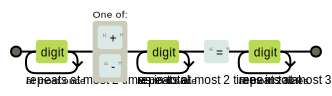

# iMatchstick - Matchstick Arithmetic Puzzle Solver and Beyond

## Basic Problem to Solve

Digits composed of matchsticks are listed as following:

A, B, C are nonnegative integers and we have A, B < 100, and C < 200. Input an equation in forms of A+B=C or A-B=C with ONE matchstick misplaced like this:

List ALL answer(s) to this puzzle to correct the equation by moving ONLY ONE matchstick.

["49+68=117"]

### Examples

## Optional Bonus Problem to Solve

Given the number of sticks to move, output all answers to a puzzle.

For example, given 2 as the number of sticks to move and

the answers are:
["3+9=12","8+4=12"]

Given 3 as the number of sticks to move and the same puzzle, the answers are:

## Notice

* A legal puzzle follows the following pattern.

* Plus sign + can be changed to minus sign - by moving a matchstick off and minus sign - can be changed to Plus sign + by adding a matchstick.
* Equal sign= should not be changed.
* The two sticks of 1 should only lie on the right side of the digit.
* Stick can ONLY be moved from and to the EXISTING digit(s) or the operator sign. For example, the basic problem 8-1=1 has the only correct answer 0+1=1, while 0-1=-1 is not the answer. Given 2 as the number of sticks to move, the bonus problem 10+3=8 has the only correct answer 18-9=9, while 10+3=13 is not the answer.
* Completely removal of a digit is not allowed. For example, given 2 as the number of sticks to move, the bonus problem 6+3=14 has the only correct answer 9+5=14, while 6+3=9 is not the answer.
